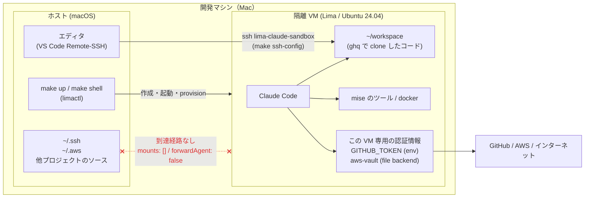

# claude-sandbox

macOS 上に [Lima](https://lima-vm.io/) で隔離された Linux VM を立て、その中で Claude Code を動かすための設定一式。

全体像:



ホストのファイルシステムは一切マウントせず（`mounts: []`）、ssh-agent も鍵も持ち込まない（`forwardAgent: false` / `loadDotSSHPubKeys: false`）。VM の中から**ホストへ戻る経路が無い**。

## 目的

ホストと VM のあいだに壁を 1 枚立て、その中で Claude Code を動かす。守りたいものは 2 つある。

### 1. ホスト（macOS）を破壊的な操作から守る

エージェントが誤って `rm -rf` のような操作をしても、被害は VM の中だけで完結する。ホストのファイルシステムを一切マウントしていないので、他プロジェクトのソースやホストの設定ファイルには最初から手が届かない。壊れたら `make recreate` で VM ごと捨てて作り直せばよい。

### 2. ホストの強力な認証情報から隔離し、Claude 専用の認証情報だけを使わせる

開発者のホストには、全リポジトリに push できる ssh 鍵や、本番環境にまで届く AWS のクレデンシャルが揃っている。エージェントにこれらをそのまま渡すのは危険が大きすぎる。

VM からはそのどれにも到達できない。ホストの `~/.ssh` も `~/.aws` もマウントせず、ssh-agent の転送も無効にしてある。VM 内の Claude Code が使えるのは、**この VM のために用意した専用の認証情報だけ** — 作業対象のリポジトリだけに絞った fine-grained PAT と、aws-vault に入れた最小権限の AWS クレデンシャル。万一の誤操作や漏洩があっても、影響範囲はそこで止まる。

何が見えて何が見えないかの一覧は「[隔離の境界線](#隔離の境界線)」を参照。

## 必要なもの

- macOS 13 以降 / Apple Silicon 推奨（`vmType: vz` を使うため）
- [Lima](https://lima-vm.io/) 2.0 以上（`limactl` が PATH にあること）

Lima の入れ方は問わない。`brew install lima` でも、[公式リリース](https://github.com/lima-vm/lima/releases)のバイナリでも、[mise](https://mise.jdx.dev/) でも構わない（mise を選ぶ場合はシェルでの有効化が要る → [CONTRIBUTING.md](CONTRIBUTING.md)）。バージョンの下限はテンプレートの `minimumLimaVersion: 2.0.0` に合わせてある。

必要なのはこれだけで、あとは `make up` が VM の中に必要なツールを入れる。

## 使い方

```sh
make up       # VM を作成・起動し、必要なツールを全部入れる (初回 10 分程度)
make shell    # VM にログインする
```

ログインしたら VM の中で claude を起動する:

```sh
claude
```

初回はブラウザ認証が走る。認証情報は VM のディスク（`~/.claude`）に残るので、`make stop` → `make up` しても再ログインは不要。

git の `user.name` / `user.email` はホストの `git config` の値が自動で入る。別の identity を使いたいときは make に渡す:

```sh
make up GIT_USER_NAME='Your Name' GIT_USER_EMAIL='you@example.com'
```

`make up` / `make reprovision` のたびに反映されるので、値を変えて実行し直せば VM 内の設定も追随する。

### GitHub への認証（fine-grained PAT）

ssh 鍵は隔離モデルを壊すので持ち込まない。GitHub へは **HTTPS + fine-grained PAT** で繋ぐ。トークンは VM 内で環境変数にセットするだけでよい:

```sh
make shell
# VM 内
export GITHUB_TOKEN=github_pat_...        # clone/fetch/push に加えて gh CLI もこの値を拾う
ghq get github.com/owner/repo             # ~/workspace/github.com/owner/repo に clone される
cd "$(ghq root)/github.com/owner/repo"
```

環境変数を読むだけの git credential helper（`~/.local/bin/git-credential-github-token`）が仕込んであるため、トークンが**ディスクに書かれることはない**。`make shell` のたびに `export` し直す運用が既定。毎回打ちたくない場合は `~/.zshrc` に書けば永続化できるが、VM のディスクに平文で残る点は理解した上で選ぶこと。

トークン未設定のまま push すると、入力待ちでハングせず即座にエラーになる（`GIT_TERMINAL_PROMPT=0`）。

必要な権限は用途しだいだが、typical には対象リポジトリに対する Contents: Read and write（PR を作るなら Pull requests: Read and write）。

### AWS への認証（aws-vault）

AWS のクレデンシャルは平文の `~/.aws/credentials` に置かず、[aws-vault](https://github.com/ByteNess/aws-vault) の **file バックエンド**（`~/.awsvault/keys/` をパスフレーズで暗号化）に保管する。

```sh
make shell
# VM 内
aws-vault add my-profile                  # パスフレーズ → Access Key ID → Secret Access Key の順で聞かれる
aws-vault exec my-profile -- aws sts get-caller-identity
```

- 暗号化された鍵は VM のディスク（`~/.awsvault/keys/`）に残る。VM を再起動しても再登録は不要で、使うたびにパスフレーズを聞かれるだけ。`make destroy` すれば消える。
- パスフレーズを忘れたら `rm -rf ~/.awsvault` して入れ直す。
- 毎回の入力が煩わしければ `export AWS_VAULT_FILE_PASSPHRASE=...` でスキップできるが、下記の理由から既定にはしていない。
- ホスト側（Makefile・`lima/`・`~/.lima/`）にはパスフレーズもクレデンシャルも一切書かない。GitHub の PAT と同じ扱い。

gnome-keyring（Secret Service）を使う構成もこの VM では動くが、デーモン常駐とブートごとのアンロック手順が要るので採っていない（`CLAUDE.md` に経緯あり）。

> [!IMPORTANT]
> `AWS_VAULT_FILE_PASSPHRASE` を `export` した状態では、VM 内の Claude Code も `aws-vault exec` で**そのクレデンシャルを権限確認なしに使える**。PAT と同じく、隔離を意図的に一点だけ開ける操作である。投入するのは最小権限のロール、できれば短命なクレデンシャルに限ること。逆に `export` しなければ、パスフレーズを知らないエージェントは非対話でクレデンシャルを取り出せない。

## コマンド一覧

| コマンド | 内容 |
| --- | --- |
| `make up` | VM を作成（初回のみ）して起動し、プロビジョニングを流す |
| `make shell` | VM にログイン（claude はログインしてから中で起動する） |
| `make dev-env` | git identity など VM 内の開発環境設定を再適用する |
| `make reprovision` | `lima/provision/` の変更だけを再適用する（VM は作り直さない） |
| `make recreate` | VM を破棄して作り直す（`lima/claude-sandbox.yaml` の変更を反映するとき） |
| `make stop` / `make destroy` | 停止 / 削除 |
| `make status` / `make validate` | 状態表示 / テンプレート検証 |
| `make ssh-config` | VS Code Remote-SSH 用の設定行を表示 |

インスタンス名を変えたい場合は `make up INSTANCE=foo` のように上書きできる。

## 隔離の境界線

| VM から見えるもの | VM から見えないもの |
| --- | --- |
| VM 自身のディスク（`~/workspace` など） | ホストのホームディレクトリ、`/Users` 以下すべて |
| インターネット（NAT 経由、制限なし） | ホストの `~/.ssh`、`~/.aws` などの認証情報 |
| VM 内で clone したコード | ホストの ssh-agent（`forwardAgent: false`） |
| VM 内で `export` した GitHub の PAT | ホスト側のトークン（make 経由でも渡していない） |
| VM 内で `aws-vault add` した AWS クレデンシャル | ホストの `~/.aws`、ホストのキーチェーン |
| VM 内の docker デーモンとコンテナ | ホストの docker（socket をホストへ転送していない） |

egress は制限していないので、VM からインターネットへは自由に出られる。「ホストを守る」ための隔離であって「外部への通信を防ぐ」ものではない点に注意。

PAT を `export` した時点で、VM 内の Claude Code はそのトークンで**できることすべて**（対象リポジトリへの push を含む）を権限確認なしに実行できる。これは隔離を意図的に一点だけ開ける操作なので、fine-grained PAT のスコープは作業対象のリポジトリだけに絞ること。AWS クレデンシャル（`AWS_VAULT_FILE_PASSPHRASE` を `export` した場合）についても同じことが言える。

## ホストのエディタから編集する

ホームをマウントしていないため、ホストのエディタで VM 内のファイルを直接開くことはできない。VS Code なら Remote-SSH で繋ぐ:

```sh
make ssh-config   # 表示された Include 行を ~/.ssh/config に追記する
```

追記後は `ssh lima-claude-sandbox` で接続でき、VS Code の Remote-SSH からも同じホスト名が選べる。

## 入っているもの

システムパッケージ（apt）は `curl` / `git` / `build-essential` などの土台と、docker・zsh のみ。ランタイムと CLI は [mise](https://mise.jdx.dev/) が管理する:

`node` (lts), `claude`, `gh`, `ghq`, `ripgrep`, `fd`, `jq`, `starship`, `sheldon`, `python` (3.13), `uv`, `go`, `aws-vault`, `awscli`

ログインシェルは **zsh**（`05-zsh.sh` が `chsh` する）。履歴・補完・Emacs キーバインドは設定済みで、`starship` のプロンプトも `make shell` などの対話シェルで自動的に有効になる（`50-starship.sh` が配線する）。starship の設定ファイルは置いていないので既定のプリセットで動く。

シェルの設定は `~/.zprofile` / `~/.zshrc` に直接書かれておらず、`~/.config/claude-sandbox/zprofile.d/` と `~/.config/claude-sandbox/zshrc.d/` に置かれた断片をローダが番号順に読み込む形になっている。これらは `make reprovision` のたびに上書きされるので、**自分の設定は rc ファイル本体（ローダのマーカーブロックの外）に書くこと。**

zsh のプラグインは [sheldon](https://github.com/rossmacarthur/sheldon) が管理していて（`60-sheldon.sh` が配線する）、既定で以下が有効:

- [zsh-autosuggestions](https://github.com/zsh-users/zsh-autosuggestions) — 履歴からの候補を薄く先出しする。`→` で確定。
- [zsh-syntax-highlighting](https://github.com/zsh-users/zsh-syntax-highlighting) — 入力中のコマンドを着色する（存在しないコマンドは赤）。

プラグインを足すときは `lima/provision/sheldon.plugins.toml` に書いて `make reprovision`。`sheldon add` を VM 内で直接叩いても、この設定ファイルは次のブートでリポジトリ側の内容に戻る。

`ghq` の clone 先（`ghq.root`）は `~/workspace` に設定してあるので、`ghq get` したリポジトリは `~/workspace/github.com/owner/repo` に並ぶ。

追加したいものは `lima/provision/mise.vm.toml` に書いて `make reprovision`。ルートの `mise.toml` はホスト側の開発ツール用で別物なので、混同しないこと。

### Docker

`docker` / `docker compose` / `docker buildx` が VM 内で使える。デーモン + systemd 管理で mise では扱えないため、これだけは apt（`docker.io` ほか）で入れている。

```sh
make shell
# VM 内
docker run --rm hello-world
```

`sudo` も再ログインも要らない。`docker.socket` の `SocketUser` を VM のユーザーにしてあるため（`usermod -aG docker` 方式だと、Lima が SSH 接続を多重化する都合で追加したグループが次の VM 再起動まで効かない）。

ソケットはホストへ転送していないので、**ホストの `docker` CLI からは見えない**。コンテナも VM 内で完結する（ホストのファイルシステムはそもそもマウントしていないので、`-v` でホストのディレクトリを渡すことはできない）。

## 構成

```
Makefile                        1 コマンドのエントリポイント
mise.toml                       ホスト側の開発ツール (CONTRIBUTING.md 参照)
lima/claude-sandbox.yaml        Lima テンプレート (VM のスペック・隔離設定)
lima/provision/
  00-system-packages.sh         apt で土台のパッケージを入れる   (root)
  mise.vm.toml                  VM のツール定義 → VM の ~/.config/mise/config.toml
  sheldon.plugins.toml          zsh プラグイン定義 → VM の ~/.config/sheldon/plugins.toml
  05-zsh.sh                     ログインシェルを zsh にし、rc ファイルの土台を作る
  10-mise.sh                    mise 本体の導入とツールのインストール
  20-dev-env.sh                 ~/workspace / git identity / GitHub HTTPS 認証の設定
  30-docker.sh                  docker.socket の所有者設定とサービス有効化
  40-aws-vault.sh               aws-vault のバックエンド設定
  50-starship.sh                シェルプロンプト (starship) の配線
  60-sheldon.sh                 zsh プラグインマネージャ (sheldon) の配線
```

プロビジョニングスクリプトは VM の**毎回のブートで実行される**ため、すべて冪等に書いてある。詳細は `CLAUDE.md` を参照。

## このリポジトリに手を入れる

Lima テンプレートや provision スクリプト、CI を編集するときのセットアップ（ホスト側の開発ツール・編集時のガード・依存の更新）は [CONTRIBUTING.md](CONTRIBUTING.md) にまとめてある。VM を使うだけならここまでで足りる。
